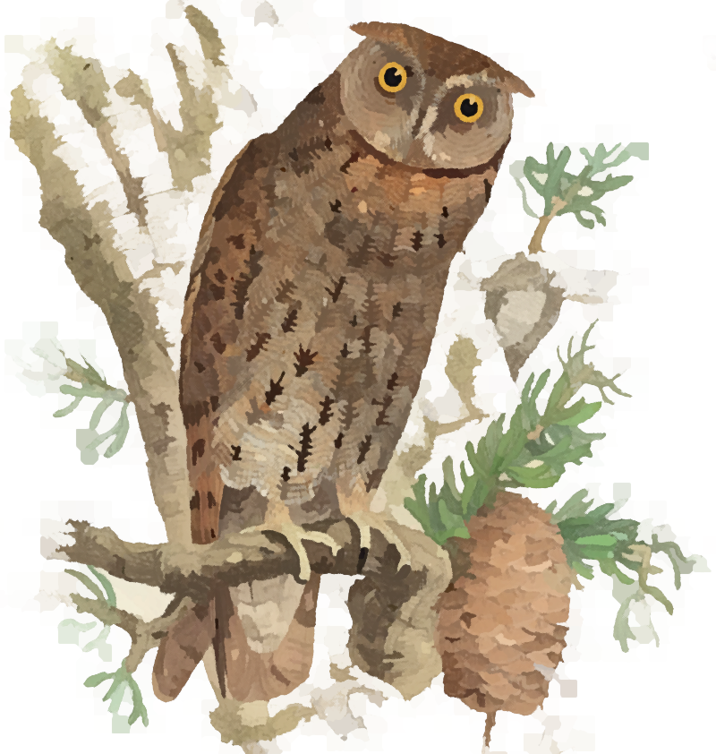

# Curupixá

__Leonardo de Oliveira Martins<sup>1</sup>__
<br>
<sub>1. Quadram Institute Bioscience, Norwich Research Park, NR4 7UQ, UK</sub>

## Introduction

This library provides low level functions used by other phylogenetic programs. Currently it is only a testing
environment. 
In all likelihood you don't need to install it, since the derived software will take care of it &mdash; assuming you
downloaded the derived software from github with `--recursive`.
It will be a replacement or auxiliary to [biomcmc-lib](https://github.com/quadram-institute-bioscience/biomcmc-lib).

**Etymology:** Curupixá is the name of a Brazilian tree (_Micropholis venulosa_), also known as salgueiro, Guajará, Grumixava, Grubixa, cubixa, Abiurana, Bacu Mixa, etc. 
## Installation
This library is usually not installed directly, but as a submodule of another project. 
It includes, however, the `makefile.am` and `configure.ac` for autotools, and it provides unit tests from the
[libcheck](https://github.com/libcheck/check) library as well as custom checks. 

For full functionality you will need `openmp`, `libcheck`, `zlib`, `bz2`, and `liblzma`. 
If you can install them system-wide:
```[bash]
## 'bootstrap' the configuration files (needed when cloning from github):
/home/simpson/$ apt-get install pkg-config autotools-dev autoconf automake libtool
/home/simpson/$ (cd curupixa && autoreconf)  ## the parentheses avoid entering the directory afterwards
## install extra libraries: 
/home/simpson/$ apt-get install zlib1g-dev libomp-dev libbz2-dev check liblzma-dev
```

If you do not have admin privileges but you have conda/mamba:
```
/home/simpson/$ mamba install automake libtool pkg-config make libgcc-ng check zlib xz bzip2 libgomp
/home/simpson/$ (cd curupixa && autoreconf)
```

If you really want to install this library separately but you do not have admin privileges and you don't want to use conda, 
then you'll have to pretend we are in the nineties and install all dependencies by hand. 
The libraries rely on `pkg-config` to find their location, otherwise you'll see a cryptic error message about `possibly
undefined macro`. 
If you can only install `pkg-config` through conda then you may need to install the C libraries via conda as well.
Or checking and updating your [`$PKG_CONFIG_PATH` environment variable](https://people.freedesktop.org/~dbn/pkg-config-guide.html).

This sofware uses `autotools`, which means you can install it with `configure` + `make`.
You may need to define where you want it installed with `configure --prefix=DIR`, which is where are your unix-like
`include/`, `lib/`, and `bin/` directories. My favourite is `~/local`. Another popular option if you are on a conda
environment is `--prefix=${CONDA_PREFIX}`

Here is an example of its installation, although **in most cases you do not need to install this library separately**:

```[bash]
/home/simpson/$ git clone https://github.com/leomrtns/curupixa.git
/home/simpson/$ cd curupixa && ./autogen.sh
/home/simpson/$ mkdir build && cd build
/home/simpson/$ ../curupixa/configure --prefix=${HOME}/local
/home/simpson/$ make; make install
/home/simpson/$ make check  # battery of unit and integration tests for both tatajuba and biomcmc-lib
```

Notice that two libraries are installed, `libcurupixa.la` and `libcurupixa_static.la` (with `.a` and `.so` versions). 
The first (`libcurupixa.la`) is installed with `make install` and is available "globally" or wherever you tell it with
`--prefix`.
The second version is a [convenience library](https://www.gnu.org/software/automake/manual/html_node/Libtool-Convenience-Libraries.html)
which is used with other programs (through `autotools` subdirs usually) and is not shared. 

Remember that the installation and `autogen.sh` in particular modify/add local files; therefore updating the repository
from github will complain about uncommited changes. You can run `git stash` (or reinstall from scratch) before `git pull`.


## License 
SPDX-License-Identifier: GPL-3.0-or-later

Copyright (C) 2022-today  [Leonardo de Oliveira Martins](https://github.com/leomrtns)

This is free software; you can redistribute it and/or modify it under the terms of the GNU General Public
License as published by the Free Software Foundation; either version 3 of the License, or (at your option) any later
version (http://www.gnu.org/copyleft/gpl.html).

The [logo owl](https://www.flickr.com/photos/biodivlibrary/51267563412/in/album-72157719506234015/) is based on the 
[Fauna japonica v.4 Aves](https://www.flickr.com/photos/biodivlibrary/albums/72157719506234015/with/51267563412/)
provided by the Biodiversity Heritage Library under the Public Domain.


